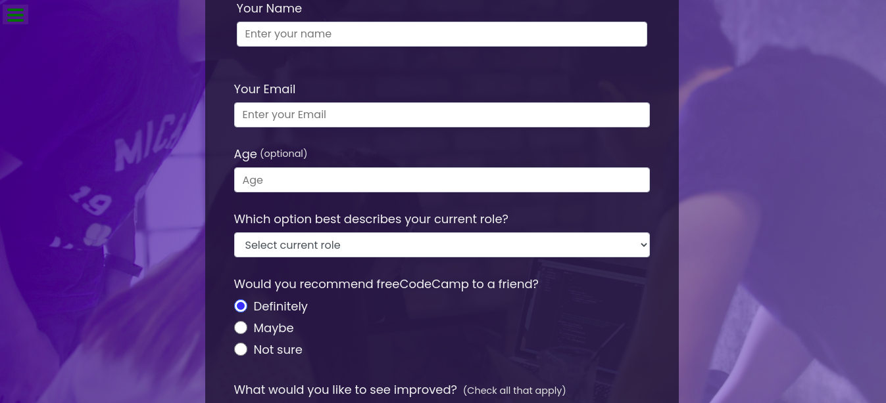

# Learn code review prooject

This project, we learn all the best practise for code review , In the sense that we need to meke sure all the nessary requirements are met and ready to move forword ,

## Built With

- HTML ,CSS and Javasript

## Live Demo

[Live Demo Link](https://jenadiusnicholaus.github.io/learn-code-review/)

## Prerequisites

- Html,css, javacript

## Author

 Jenadius Nicholaus

- GitHub: *[@jenadiusnicholaus](https://github.com/jenadiusnicholaus/)*.

- Twiter: *[@jenadius_kaim](https://twitter.com/jenadius_kaim)*.

- LinkedIn: *[@jenadiusnicholaus](https://www.linkedin.com/in/jenadius-nicholaus-73126819b/)*.

 Contributing

 Contributions, issues, and feature requests are welcome!

## Acknowledgments

- Hat tip to anyone whose code was used
- Inspiration
- etc
